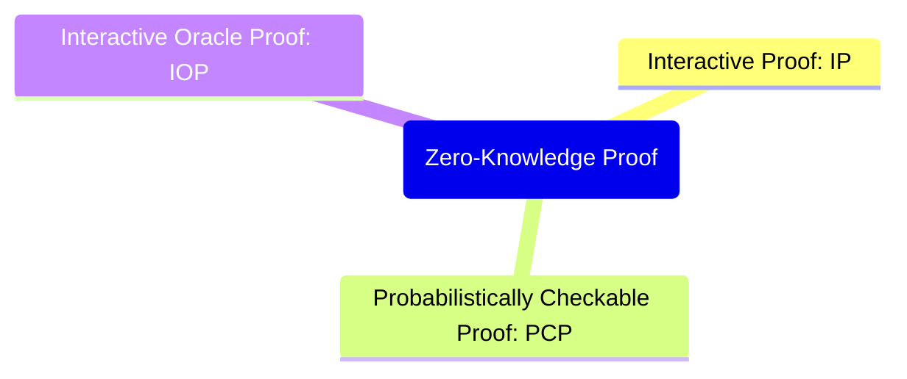
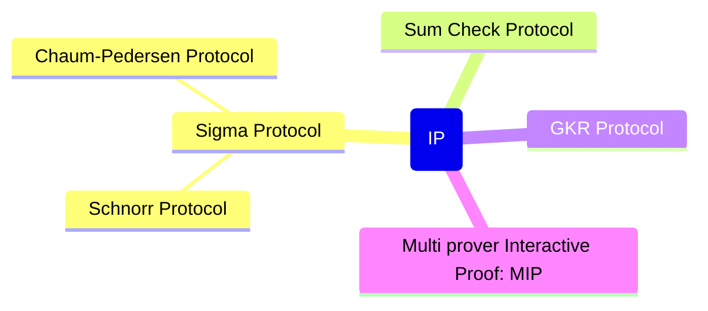

# zkp_relation_map

# Interactive Proof

## Sigma Protocol
3ステップ（commit → challenge → response）で構成される対話型ゼロ知識証明の基本形。

- **概要:**
  
  $$P \xrightarrow{a} V,\quad V \xrightarrow{e} P,\quad P \xrightarrow{z} V$$
  
  ここで、 $a$ はコミットメント、 $e$ はチャレンジ、 $z$ は応答。

### Schnorr Protocol
離散対数問題に基づいたゼロ知識証明プロトコル。

- **公開情報:** $g$, $y = g^x$
- **手順:**
  1. $P$: ランダムな $r$ を選び、 $t = g^r$ を送信。
  2. $V$: チャレンジ $e$ を送る。
  3. $P$: 応答 $s = r + ex$ を送る。
  4. $V$: $g^s \stackrel{?}{=} t \cdot y^e$ を確認。

### Chaum-Pedersen Protocol
同じ指数を持つ2つの値が正しいことを証明するプロトコル。

- **目的:** $(g^x, h^x)$ の形式における $x$ の一致を証明。
- **検証式:**
  
  $$g^s \stackrel{?}{=} a \cdot g_1^e,\quad h^s \stackrel{?}{=} b \cdot h_1^e$$

---

## Sum-Check Protocol
多項式の合計がある値に等しいことを対話的に証明するプロトコル。

- **目標:**
  
  $$\sum_{x_1, ..., x_n \in \{0,1\}} f(x_1, ..., x_n) = T$$
  
- **応用:** GKRプロトコルの基盤、IP=PSPACEの証明にも利用される。

---

## GKR Protocol
回路の計算結果の正しさを効率的に検証するプロトコル。

- **検証対象:** ログ空間で表現された回路の出力。
- **特徴:** 各層の演算を Sum-Check で逐次検証。

---

## Multi prover Interactive Proof (MIP)
複数のProverを使った拡張モデル。Prover間の通信を禁止することで検証能力が向上する。

- **結果:**
  
  $$\text{MIP} = \text{NEXP}$$
  
- **形式例（2-Prover, 1-Round）:**
  
  $$V \xrightarrow{q_1} P_1,\quad V \xrightarrow{q_2} P_2$$
  
  $$P_1 \rightarrow a_1,\quad P_2 \rightarrow a_2$$
  
  $$V(a_1, a_2) \text{ で検証}$$
